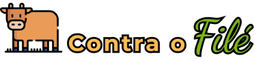

<h1 align="center">
  
  
Contra o Filé

</h1>

  <strong>
   🥬 O restaurante Contra o Filé é um restaurante vegano com a proposta de ser saudável e com custo acessível🍉  
  </strong>

  
  
  
  
  

<h2>
  📋 Table of contents
</h2>
<ul>
  <li><a href="https://github.com/Silvio-Ronaldo/contra-o-file#%EF%B8%8F-technologies">Technologies</a></li>
  <li><a href="https://github.com/Silvio-Ronaldo/contra-o-file#-author">Author</a></li>
  <li><a href="https://github.com/Silvio-Ronaldo/contra-o-file#%EF%B8%8F-license">License</a></li>
</ul> 

<h2>🛡️ Technologies</h2>

The main tools used in the development of the Contra o Filé: 

<ul>
  <li><a href="https://pt-br.reactjs.org">React</a></li>
  <li><a href="https://www.gatsbyjs.com">Gatsby</a></li>
  <li><a href="https://www.typescriptlang.org">TypeScript</a></li>
</ul> 

<h2>👽 Author</h2>
<table>
  <tr>
    <td align="center"><a href="https://github.com/Silvio-Ronaldo"> <b>Silvio Ronaldo</b></a> <a href="https://github.com/Silvio-Ronaldo" title="Silvio Ronaldo">🍀</a></td>
  </tr>
</table>

Leave your star, fork the project or open a pull request ❤️

Contact me on social networks: 

 

<h2>⚖️ License</h2>

<strong>Contra o Filé mobile app is BSD Zero Clause licensed, as found in the <a href="./LICENSE">LICENSE file</a>.</strong>

